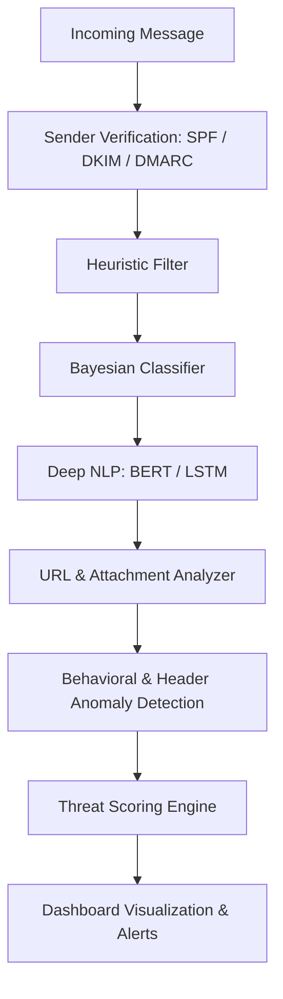

# 🧠 SpamVision — AI-Powered Spam & Phishing Detection Suite

**Author:** Bharath R  
**Version:** 1.0  
**License:** MIT  

**Code Statistics:**   

SpamVision is a next-generation, AI-driven **spam and phishing defense system** built to protect users across **SMS and Gmail** communication channels.  
It combines **machine learning**, **deep learning**, and **LLM-based NLP** to intelligently detect, explain, and prevent modern spam threats — from **smishing** to **AI-generated phishing**.

---

## 🚀 Overview

SpamVision isn't just a spam filter — it’s an **intelligent defense engine** that understands human language, behavior, and deception tactics.  
It uses a **multi-stage hybrid architecture**:

- ⚙️ **Heuristic + Rule-based filtering** for instant triage  
- 🧮 **Bayesian & ML classifiers** for adaptive learning  
- 🧠 **Deep NLP (BERT, LSTM)** for semantic and contextual analysis  
- 🌐 **RAG (Retrieval-Augmented Generation)** for contextual reasoning  
- 🔍 **Anomaly detection** to identify impersonation and behavioral deviations  
- 🧩 **Cross-channel protection** for SMS, Email, and QR-based (Quishing) threats  

---

## 🧩 Core Features

| Category | Description |
|-----------|-------------|
| 🛡️ **AI Detection Engine** | LSTM + Transformer hybrid model for context-aware spam filtering |
| 🔗 **URL & Attachment Sandboxing** | Detects malicious payloads in real-time |
| 🧠 **LLM Threat Summaries** | Converts complex attacks into simple explanations |
| 📊 **Behavioral Analysis** | Learns normal sender behavior to detect anomalies |
| 💬 **Cross-Channel Defense** | Unified protection across SMS and Gmail |
| 🧩 **Explainable AI** | Every blocked message includes an explainable “why” |
| 🧭 **Privacy-First Design** | Built with on-device intelligence & federated learning |
| 🌈 **Beautiful Flutter UI (Future Web + App)** | Clean, animated dashboards with visual threat graphs |

---

## 🧱 Architecture Diagram



---

## ⚙️ Tech Stack

| Layer              | Tools / Frameworks                                           |
| ------------------ | ------------------------------------------------------------ |
| **Frontend** | Flutter (for mobile & web dashboards)                        |
| **Backend API** | FastAPI / Flask (Python 3.10+)                               |
| **ML/NLP Stack** | scikit-learn, TensorFlow, PyTorch, Hugging Face Transformers |
| **Database** | Firestore / PostgreSQL                                       |
| **Deployment** | Docker, Kubernetes, or GCP Cloud Run                         |
| **Authentication** | Firebase Auth / Google OAuth 2.0                             |
| **CI/CD** | GitHub Actions + Cloud Build                                 |

---

## 🧪 Quick Start

### 1️⃣ Clone the repository

```bash
git clone [https://github.com/yourusername/spamvision.git](https://github.com/yourusername/spamvision.git)
cd spamvision
```

### 2️⃣ Create a virtual environment

```bash
python3 -m venv venv
source venv/bin/activate
```

### 3️⃣ Install dependencies

```bash
pip install -r requirements.txt
```

### 4️⃣ Run the backend API

```bash
python services/api/app/main.py
```

### 5️⃣ Run the frontend (optional)

```bash
cd frontend
flutter run
```

---

## 🧠 Future Roadmap

* [ ] Deploy pre-trained spam models via API
* [ ] Add federated learning updates from edge devices
* [ ] Integrate Gmail API + SMS gateway
* [ ] Create visualization dashboards (Flutter Web)
* [ ] Add automatic RAG-based threat reporting

---

## 📜 License

This project is licensed under the [MIT License](LICENSE).
